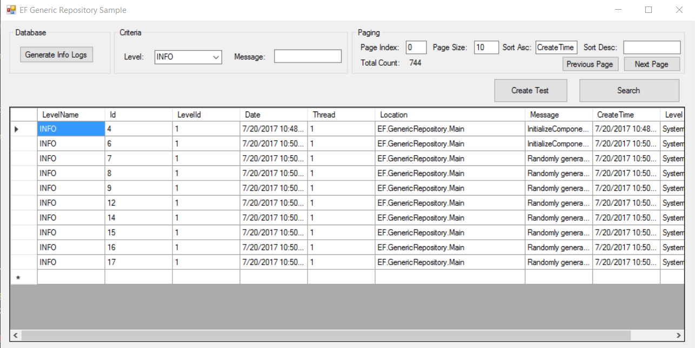

Entity Framework Generic Repository
========================================
# Introduction

A generic Entity Framework repository pattern implementation.

# Usage

* Unzip `Database\Database.7z`, attach to LocalDB, or restore to your favoriate Sql Server instance and change the connection string in App.Config.
* Open solution and run the application.

# Base Repository

The base repository exists in `Common\AbstractRepository.cs`, it handles the basic CRUD operations, for example, methods like Find with pagination, Create, Update, Delete. 

The Find method, which has many overloading, handles pagination, sorting, total count. You can use this kind of generic methods for all the entities. 

It supports async call and also in the parent-child table scenario, you can pass the include parameter to do the join table.

# Derived Repository

For certain business logic, you may need derived repository from the base repository to handle more business logic.

In the sample, you may find `Repository\LogRepository.cs` which is a repository for Log. In this example, i don't have additional business logic, so it's just look like this:

```csharp
public class LogRepository : AbstractRepository<Log, int>
{
    public LogRepository(EFContext context)
        : base(context)
    {
    }
}
```
And the in the caller code, you can just use it like:

```csharp
var repo = uow.GetLogRepository(); //get repo from UnitOfWork

var result = repo.Find( GetSpecification(),
                        pageIndex,
                        pageSize,
                        List<SortDescriptor> sortings，
                        l => l.Level); //join the Level table
```

# Unit of Work

To implement the transaction concept, multiple repository share a common EFContext. You may find the example in `Common\EFUnitOfWork.cs`. For simplicity, I don't use and inject dependency, just to demonstrate the concept.

# Specification Pattern

In Find method of the generic repository, it accept a ISpecification interface. You can define some Specification for the query to fix the criteria and you may have better control of the query, for example:

```csharp
public class LogSearchSpecification : ISpecification<Log>
{
    public string LevelName { get; set; }
    public string Message { get; set; }
    public Expression<Func<Log, bool>> ToExpression()
    {
        return log => (log.Level.Name == LevelName || LevelName == "") &&
                      (log.Message.Contains(Message) || Message == "");
    }

    public bool IsSatisfiedBy(Log entity)
    {
        return (entity.Level.Name == LevelName || LevelName == "") &&
               (entity.Message.Contains(Message) || Message == "");
    }
}
```

# Entity Generation

I prefer the database first approach because for complex system, I like to start from the database design and generate the POCO classes. Of course, you may use the code first approach, there's no limitation.

In the `Entity\EF.GenericRepository.Entity.edmx`, you can do reverse engineering to generate class from database.

# Logging

I like to check what sql the Entity Framework generates so that I can make sure there won't be some performance issue for example in the for loop, query the database in each iteration.

In the `Common\EFContext.cs`, there's a switch `EnableTraceSql`, it will populate every sql statement which entity framework sends to database. And I use NLog to store the sql statements in the Log table. Every time you hit the Search button in the WinForm example, you may find there are some logs inserted into Log table.


# Sample UI to Test

After preparing the database, you can directly compile and run the sample application.

